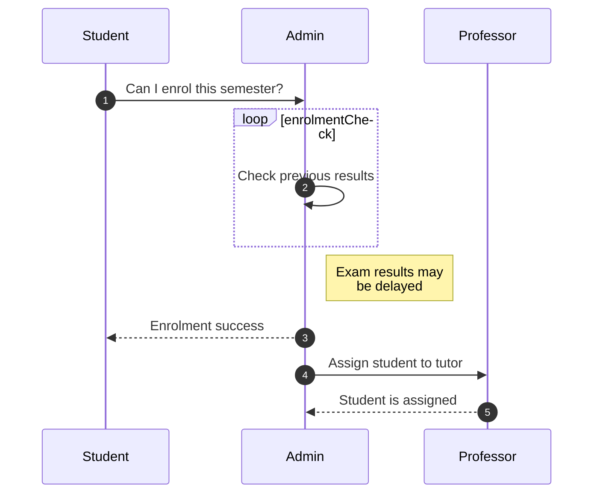

# showCase-2
Just showing some Features and Capabilities ...

```mermaid
sequenceDiagram
    autonumber
    Student->>Admin: Can I enrol this semester?
    loop enrolmentCheck
        Admin->>Admin: Check previous results
    end
    Note right of Admin: Exam results may <br> be delayed
    Admin-->>Student: Enrolment success
    Admin->>Professor: Assign student to tutor
    Professor-->>Admin: Student is assigned
```
